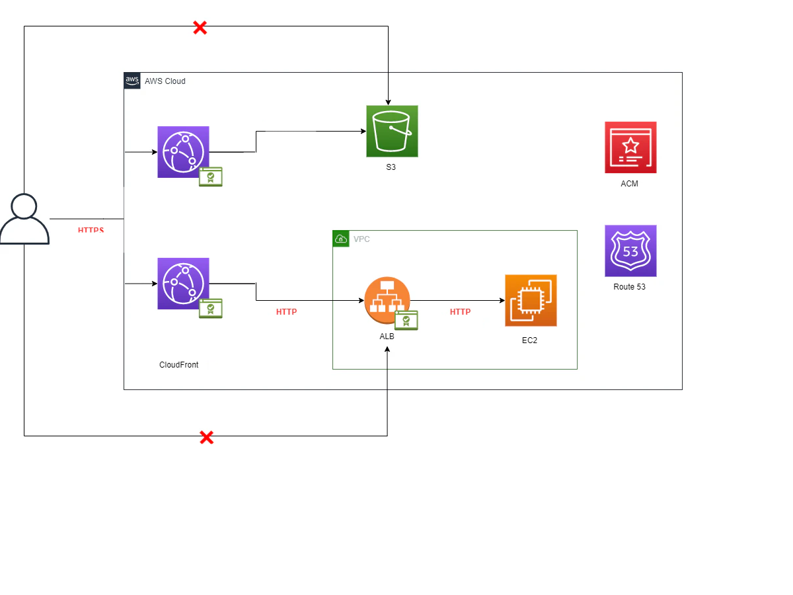

# Desafío Full Stack en AWS 🚀

## Arquitectura 🏗️

La siguiente arquitectura ilustra cómo fluye una aplicación en el ecosistema AWS, integrando servicios como Route 53, CloudFront, ACM, S3, ALB y EC2.



## Componentes 🛠️

### S3 🗃️

El servicio de S3 se emplea para almacenar contenido estático y es la base de muchos sitios web. Aquí tienes un ejemplo de cómo se vería una política de S3:

```json
{
  "Version": "2008-10-17",
  "Id": "Policy",
  "Statement": [
    {
      "Effect": "Allow",
      "Principal": "*",
      "Action": "s3:GetObject",
      "Resource": "arn:aws:s3:::your-bucket/*"
    }
  ]
}
````

## CloudFront 🌐
### CloudFront distribuye nuestro sitio web de manera eficiente y segura. La siguiente es una política de ejemplo para configurar CloudFront:

````
{
  "Version": "2008-10-17",
  "Id": "PolicyForCloudFrontPrivateContent",
  "Statement": [
    {
      "Sid": "AllowCloudFrontServicePrincipal",
      "Effect": "Allow",
      "Principal": {
        "Service": "cloudfront.amazonaws.com"
      },
      "Action": "s3:GetObject",
      "Resource": "arn:aws:s3:::xxxxxxxxxxxx/*",
      "Condition": {
        "StringEquals": {
          "AWS:SourceArn": "arn:aws:cloudfront::xxxxxxxxxxxx:distribution/xxxxxxxxxxxx"
        }
      }
    }
  ]
}
````
## EC2 💻
###  EC2 es el músculo detrás de nuestra aplicación. Configuramos un Grupo de Seguridad para permitir tráfico en el puerto 80. Aquí un script para empezar:

````
#!/bin/bash
dnf update -y
dnf install -y docker
service docker start
systemctl enable docker.service
docker pull santosderek/spjuiceshop
docker run -d -p 80:3000 santosderek/spjuiceshop
````


## Video Tutorial 📺
He aquí los enlaces a tutoriales paso a paso que te ayudarán a poner en marcha tu proyecto:

- [Instalar un sitio web estático con S3](https://youtu.be/4bxVDFwqd5o)
- [Configurar EC2 y ALB](https://youtu.be/4bxDFvqd5o)


##Hecho con ❤️ y ☕ por [Gabrriel Saiz]. Gracias a el Material de este Crak https://github.com/santos-pardos